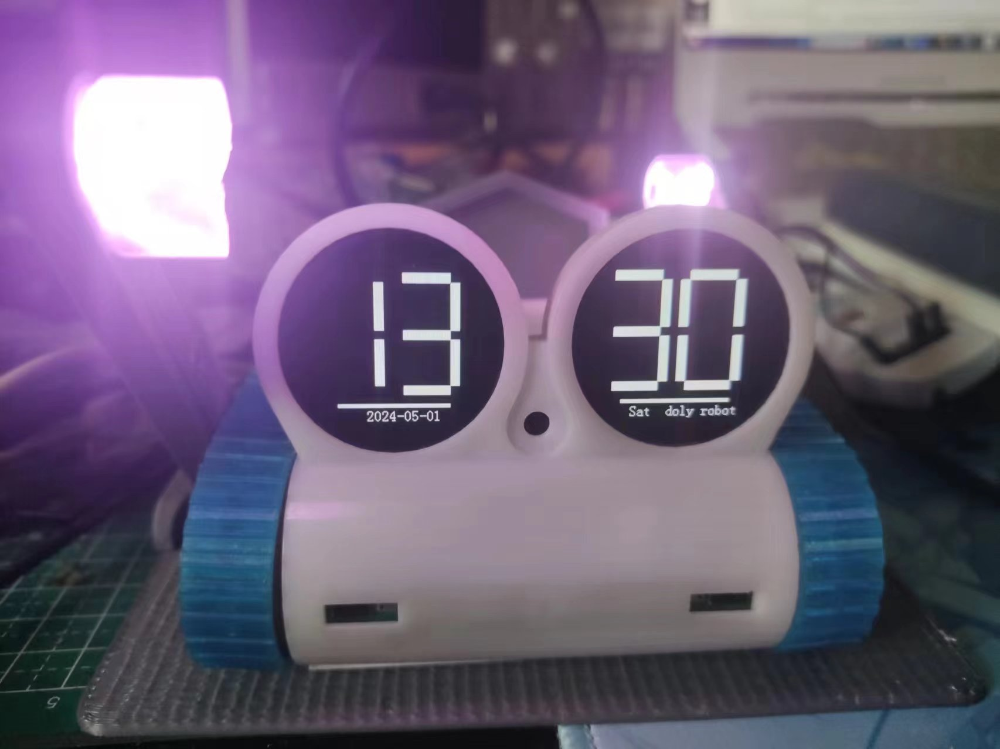

# DIY DOLY robot open-source 

​    On the basis of the official hardware, I write my own DOLY robot code, welcome to participate
    
    Raspberry Pi Robot
## Project Introduction

   The project plans to write the DOLY robot application layer and driver layer code. The application layer code is built using cmake, and you are welcome to write your own bot program together

> ​    Official github： [robotdoly/DOLY-DIY: DIY Doly project (github.com)](https://github.com/robotdoly/DOLY-DIY)

## Example of use

`// Build app dependencies`

`cd DOLYDV1-1.0/app/build`

`cmake .`

`make`

`// Compile the overall program`

`cd DOLYDV1-1.0/use/build` 

`cmake .`

`make`

`// Run the program`

`cd DOLYDV1-1.0/use/build/bin`

`./doly_core`

## Your help is welcome
